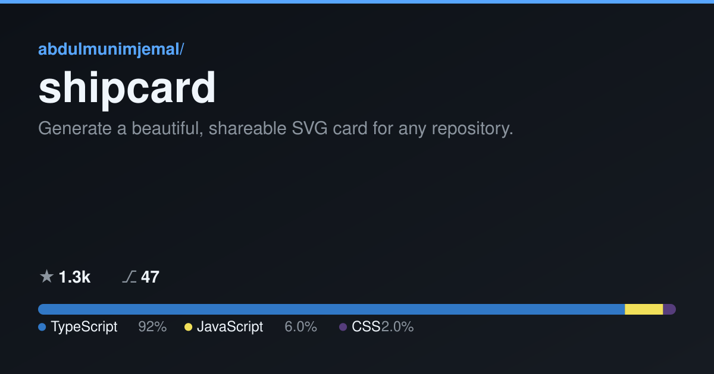

# shipcard

Generate a beautiful, shareable **SVG card** for any repository — name,
description, primary languages (with a colored language bar), stars/forks, and
owner. Perfect for social previews (Open Graph) and README headers.



- **Pure, well-tested renderer** — `renderCard(data)` returns a standalone SVG.
- **Two modes** — fetch from GitHub, or build entirely offline from a local repo.
- **No native deps** — SVG only (a future `--png` is noted below).

## Install

```sh
npm install -g shipcard
# or run without installing:
npx shipcard <owner/repo>
```

Requires Node.js >= 18.

## Usage

### GitHub mode

Fetch repo metadata and the language breakdown from the GitHub REST API:

```sh
shipcard abdulmunimjemal/shipcard -o card.svg
```

Set `GITHUB_TOKEN` to lift the unauthenticated rate limit (optional):

```sh
GITHUB_TOKEN=ghp_xxx shipcard facebook/react -o react.svg
```

### Local mode (offline, no network)

Build a card from a local repository — reads `package.json` (name,
description), the git `origin` remote (owner/name), and computes the language
breakdown by scanning file extensions (skipping `node_modules`, `.git`,
`dist`, etc.):

```sh
shipcard --local .                 # current directory, SVG to stdout
shipcard --local ../my-project -o my-project.svg
```

### Options

| Option | Description |
| --- | --- |
| `-o, --out <file>` | Write the SVG to `<file>` (default: stdout). |
| `--theme <name>` | `dark` (default) or `light`. |
| `--size <name>` | `og` — 1200×630 social size (default); `card` — compact. |
| `--local [path]` | Offline mode; scan `[path]` (default: current directory). |
| `--summary` | Replace the description with a one-line AI summary (off by default). |
| `--base-url <url>` | Base URL for the `--summary` API (default: OpenAI). |
| `-h, --help` | Show help. |
| `-v, --version` | Show version. |

Exit codes: `0` ok, `1` fetch error, `2` usage error.

### AI summary (optional, off by default)

With `--summary`, shipcard asks an OpenAI-compatible chat endpoint for a single
punchy line describing the repo, using your own `OPENAI_API_KEY`. Without the
flag, the card uses the repo description and makes **no** AI calls.

```sh
OPENAI_API_KEY=sk-xxx shipcard abdulmunimjemal/shipcard --summary -o card.svg
# point at any OpenAI-compatible API:
shipcard owner/repo --summary --base-url https://my-gateway.example/v1
```

## Programmatic API

`renderCard` is a pure function and is exported for direct use:

```ts
import { renderCard, computeLanguages } from "shipcard";

const svg = renderCard({
  name: "shipcard",
  owner: "abdulmunimjemal",
  description: "Generate a beautiful, shareable SVG card for any repository.",
  languages: computeLanguages({ TypeScript: 9200, JavaScript: 600 }),
  stars: 1280,
  forks: 47,
});
```

Also exported: `computeLanguages`, `fetchGitHubCard`, `buildLocalCard`,
`generateSummary`, `colorForLanguage`, and the `LANGUAGE_COLORS` map.

## Roadmap

- `--png` output (currently SVG only, to avoid native dependencies in v0.1).

## License

MIT © 2026 Abdulmunim Jemal
